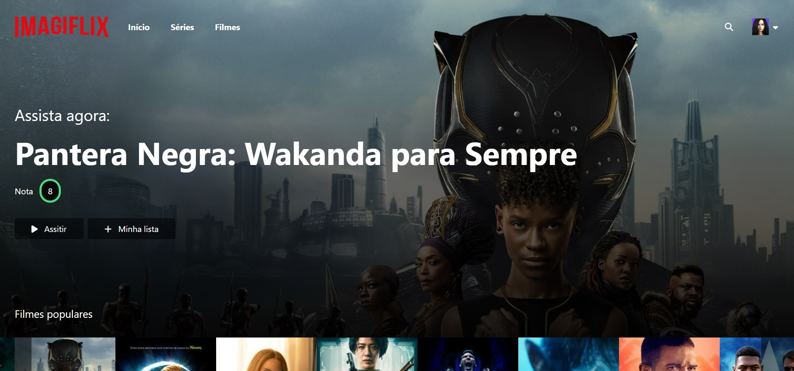

<h1 align="center"> Imagiflix </h1>

Project designed and provided by <a href='https://www.linkedin.com/school/imagine-school/mycompany/' target='_blank'>Imagine School</a>.
 
The project is a clone of Netflix, using the API The Movie DataBase.

  <a href="#technologies">Technologies</a>&nbsp;&nbsp;&nbsp;|&nbsp;&nbsp;&nbsp;
  <a href="#installation">Installation</a>&nbsp;&nbsp;&nbsp;|&nbsp;&nbsp;&nbsp;
  <a href="#layout">Layout</a>&nbsp;&nbsp;&nbsp;&nbsp;&nbsp;&nbsp;

 

  

<h1 id='technologies'>🖱️ Technologies</h2>

This project was made with the following technologies/libraries:

- ReactJS
- TypeScript
- TailwindCSS
- Font Awesome
- Slick Carousel
- FB Emitter
- Axios
- The Movie DataBase ( API )
- Create React App ( Scaffold )

 

<h1 id='layout'>🖥️ Layout</h1>

> To see the Deploy, check [THIS LINK](https://imagiflix-drab.vercel.app/#series)

 

<h1 id='installation'>📤 Installation</h1>

> <h3>Firstly, you need to <strong>clone the project</strong> on your machine:</h3>
 

<code>git clone https://github.com/cristian-sbardelotto/imagiflix</code>

 

> <h3>After that, open the project folder and <strong>install the dependencies:</strong></h3>

<code>npm i</code>

<code>yarn</code>

> <h3>To <strong>run the project</strong> on your browser, use:</h3>

<code>npm run start</code>

<code>yarn start</code>

 

> <h3>To <strong>use Tailwind classes</strong> and <strong>create your own style</strong>, use:</h3>

<code>npm run tailwind:css</code>

<code>yarn tailwind:css</code>

 

---

<h2 align='center'>Enjoy this project!</h2>

 

Developed with ❤️ by <strong>Cristian Sbardelotto</strong>

 

[Check my portfolio](https://bit.ly/portfolioSbardelotto)

